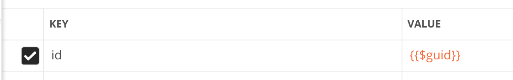

*****************
Dynamic variables
*****************

Dynamic variables can only be used in the request builder. They do not work in scripts (pre-request/tests)!

Before Postman 7.2, only the following dynamic variables were available:

+---------------+-----------------------------------------------------+--------------------------------------+
| Variable name | Description                                         | Example                              |
+===============+=====================================================+======================================+
| $guid         | Generates a GUID (Globally Unique Identifier) in v4 | 15aacbb1-1615-47d8-b001-e5411a044761 |
+---------------+-----------------------------------------------------+--------------------------------------+
| $timestamp    | Returns the current timestamp                       | 1561013396                           |
+---------------+-----------------------------------------------------+--------------------------------------+
| $randomInt    | Generates  random integer between 0 and 1000        | 764                                  |
+---------------+-----------------------------------------------------+--------------------------------------+

Starting with version 7.2, Postman is using the faker.js library and added more variables. If used multiple times, they can return different values per request.
Note: the autocomplete support in the Request Builder might be missing.

June 2019x

.. raw:: latex

    \begin{landscape}

.. table:: This is my table
    +-------------------------------+-------------------------------------+---------------------------------------------------------------------+-----------------------------------------------------------------------------------------------------------------------------------+
| Variable name                 | Description                         | Examples                                                            | Comment                                                                                                                           |
+===============================+=====================================+=====================================================================+===================================================================================================================================+
| $randomZipCode                | ZIP Code                            | 83932, 40260-4447                                                   | Not really useful as you cannot specify a country.                                                                                |
+-------------------------------+-------------------------------------+---------------------------------------------------------------------+-----------------------------------------------------------------------------------------------------------------------------------+
| $randomCity                   | City                                | East Ryanfurt, Jenkinsview                                          |                                                                                                                                   |
+-------------------------------+-------------------------------------+---------------------------------------------------------------------+-----------------------------------------------------------------------------------------------------------------------------------+
| $randomCityPrefix             | City prefix                         | Port, West, East, Lake, New                                         |                                                                                                                                   |
+-------------------------------+-------------------------------------+---------------------------------------------------------------------+-----------------------------------------------------------------------------------------------------------------------------------+
| $randomCitySuffix             | City suffix                         | mouth, borough, town, berg                                          |                                                                                                                                   |
+-------------------------------+-------------------------------------+---------------------------------------------------------------------+-----------------------------------------------------------------------------------------------------------------------------------+
| $randomStreetName             | Street name                         | Mckenna Pines, Schiller Highway, Vandervort Pike                    | Limited usability as you cannot specify a country.                                                                                |
+-------------------------------+-------------------------------------+---------------------------------------------------------------------+-----------------------------------------------------------------------------------------------------------------------------------+
| $randomStreetAddress          | Street with number                  | 98165 Tanya Passage, 0695 Monahan Squares                           | Warning: it may generate invalid data, with street numbers starting with 0. Limited usability as you cannot specify a country.    |
+-------------------------------+-------------------------------------+---------------------------------------------------------------------+-----------------------------------------------------------------------------------------------------------------------------------+
| $randomStreetSuffix           | Street suffix                       | Field, Bridge, Keys, Greens, Route                                  |                                                                                                                                   |
+-------------------------------+-------------------------------------+---------------------------------------------------------------------+-----------------------------------------------------------------------------------------------------------------------------------+
| $randomStreetPrefix           | Street prefix                       | a, b, c                                                             | Not sure what a street prefix is. Unknown usage.                                                                                  |
+-------------------------------+-------------------------------------+---------------------------------------------------------------------+-----------------------------------------------------------------------------------------------------------------------------------+
| $randomSecondaryAddress       | Additional address information      | Suite 760, Apt. 636, Suite 043                                      | Warning: it may generate invalid data, with numbers starting with 0. Limited usability as you cannot specify a country.           |
+-------------------------------+-------------------------------------+---------------------------------------------------------------------+-----------------------------------------------------------------------------------------------------------------------------------+
| $randomCounty                 | County                              | Bedfordshire, Cambridgeshire                                        | Limited usability as you cannot specify a country.                                                                                |
+-------------------------------+-------------------------------------+---------------------------------------------------------------------+-----------------------------------------------------------------------------------------------------------------------------------+
| $randomCountry                | Country                             | Belgium, Antarctica (the territory South of 60 deg S)               |                                                                                                                                   |
+-------------------------------+-------------------------------------+---------------------------------------------------------------------+-----------------------------------------------------------------------------------------------------------------------------------+
| $randomCountryCode            | Country code (2-letter)             | GY, TK, BG                                                          |                                                                                                                                   |
+-------------------------------+-------------------------------------+---------------------------------------------------------------------+-----------------------------------------------------------------------------------------------------------------------------------+
| $randomState                  | Random state                        | Arizona, South Dakota, Delaware                                     | Limited to US states.                                                                                                             |
+-------------------------------+-------------------------------------+---------------------------------------------------------------------+-----------------------------------------------------------------------------------------------------------------------------------+
| $randomStateAbbr              | Random state code (2-letter)        | GA, LA, AZ                                                          | Limited to US states.                                                                                                             |
+-------------------------------+-------------------------------------+---------------------------------------------------------------------+-----------------------------------------------------------------------------------------------------------------------------------+
| $randomLatitude               | Latitude                            | -79.9881, 87.8072                                                   |                                                                                                                                   |
+-------------------------------+-------------------------------------+---------------------------------------------------------------------+-----------------------------------------------------------------------------------------------------------------------------------+
| $randomLongitude              | Longitude                           | -41.5763, 10.4960                                                   |                                                                                                                                   |
+-------------------------------+-------------------------------------+---------------------------------------------------------------------+-----------------------------------------------------------------------------------------------------------------------------------+
| $randomColor                  | Color                               | lime, azure, maroon, gold, violet                                   |                                                                                                                                   |
+-------------------------------+-------------------------------------+---------------------------------------------------------------------+-----------------------------------------------------------------------------------------------------------------------------------+
| $randomDepartment             | Departments in a store              | Garden, Clothing, Grocery, Kids                                     |                                                                                                                                   |
+-------------------------------+-------------------------------------+---------------------------------------------------------------------+-----------------------------------------------------------------------------------------------------------------------------------+
| $randomProductName            | Product name                        | Intelligent Steel Sausages, Awesome Rubber Cheese                   |                                                                                                                                   |
+-------------------------------+-------------------------------------+---------------------------------------------------------------------+-----------------------------------------------------------------------------------------------------------------------------------+
| $randomPrice                  | Price                               | 244.00, 301.00                                                      | Not possible to specify a format. It seems that the price is never with a subdivision (cents). Alternative: randomCurrencyAmount. |
+-------------------------------+-------------------------------------+---------------------------------------------------------------------+-----------------------------------------------------------------------------------------------------------------------------------+
| $randomProductAdjective       | Product adjective                   | Refined, Handcrafted, Handmade, Sleek                               |                                                                                                                                   |
+-------------------------------+-------------------------------------+---------------------------------------------------------------------+-----------------------------------------------------------------------------------------------------------------------------------+
| $randomProductMaterial        | Product material                    | Frozen, Cotton, Wooden, Soft                                        |                                                                                                                                   |
+-------------------------------+-------------------------------------+---------------------------------------------------------------------+-----------------------------------------------------------------------------------------------------------------------------------+
| $randomProduct                | Simple product name                 | Salad, Cheese, Bike, Soap                                           |                                                                                                                                   |
+-------------------------------+-------------------------------------+---------------------------------------------------------------------+-----------------------------------------------------------------------------------------------------------------------------------+
| $randomCompanyName            | Company name                        | Christiansen LLC, Corwin Inc, Fahey - Boyer                         |                                                                                                                                   |
+-------------------------------+-------------------------------------+---------------------------------------------------------------------+-----------------------------------------------------------------------------------------------------------------------------------+
| $randomCompanySuffix          | Company suffix                      | LLC, Group, Inc, and Sons                                           |                                                                                                                                   |
+-------------------------------+-------------------------------------+---------------------------------------------------------------------+-----------------------------------------------------------------------------------------------------------------------------------+
| $randomCatchPhrase            | Catch phrase                        | Centralized upward-trending attitude                                |                                                                                                                                   |
+-------------------------------+-------------------------------------+---------------------------------------------------------------------+-----------------------------------------------------------------------------------------------------------------------------------+
| $randomBs                     | BS                                  | one-to-one unleash communities                                      |                                                                                                                                   |
+-------------------------------+-------------------------------------+---------------------------------------------------------------------+-----------------------------------------------------------------------------------------------------------------------------------+
| $randomCatchPhraseAdjective   | Catch phrase adjective              | Total, Diverse, Horizontal                                          |                                                                                                                                   |
+-------------------------------+-------------------------------------+---------------------------------------------------------------------+-----------------------------------------------------------------------------------------------------------------------------------+
| $randomCatchPhraseDescriptor  | Catch phrase descriptor             | leading edge, dynamic, attitude-oriented                            |                                                                                                                                   |
+-------------------------------+-------------------------------------+---------------------------------------------------------------------+-----------------------------------------------------------------------------------------------------------------------------------+
| $randomCatchPhraseNoun        | Catch phrase noun                   | Graphical User Interface, matrix, benchmark                         |                                                                                                                                   |
+-------------------------------+-------------------------------------+---------------------------------------------------------------------+-----------------------------------------------------------------------------------------------------------------------------------+
| $randomBsAdjective            | BS adjective                        | compelling, vertical, revolutionary                                 |                                                                                                                                   |
+-------------------------------+-------------------------------------+---------------------------------------------------------------------+-----------------------------------------------------------------------------------------------------------------------------------+
| $randomBsBuzz                 | BS buzz                             | strategize, redefine, streamline                                    |                                                                                                                                   |
+-------------------------------+-------------------------------------+---------------------------------------------------------------------+-----------------------------------------------------------------------------------------------------------------------------------+
| $randomBsNoun                 | BS noun                             | systems, bandwidth, paradigms                                       |                                                                                                                                   |
+-------------------------------+-------------------------------------+---------------------------------------------------------------------+-----------------------------------------------------------------------------------------------------------------------------------+
| $randomDatabaseColumn         | Database column                     | status, title, name, password, createdAt                            |                                                                                                                                   |
+-------------------------------+-------------------------------------+---------------------------------------------------------------------+-----------------------------------------------------------------------------------------------------------------------------------+
| $randomDatabaseType           | Database column type                | enum, mediumint, double, timestamp                                  |                                                                                                                                   |
+-------------------------------+-------------------------------------+---------------------------------------------------------------------+-----------------------------------------------------------------------------------------------------------------------------------+
| $randomDatabaseCollation      | Database collation                  | utf8_general_ci, utf8_bin                                           |                                                                                                                                   |
+-------------------------------+-------------------------------------+---------------------------------------------------------------------+-----------------------------------------------------------------------------------------------------------------------------------+
| $randomDatabaseEngine         | Database engine                     | MEMORY, InnoDB, CSV, MyISAM                                         |                                                                                                                                   |
+-------------------------------+-------------------------------------+---------------------------------------------------------------------+-----------------------------------------------------------------------------------------------------------------------------------+
| $randomDatePast               | Date in the past                    | Wed Mar 06 2019 04:17:52 GMT+0800 (WITA)                            |                                                                                                                                   |
+-------------------------------+-------------------------------------+---------------------------------------------------------------------+-----------------------------------------------------------------------------------------------------------------------------------+
| $randomDateFuture             | Date in the future                  | Wed Nov 20 2019 20:26:40 GMT+0800 (WITA)                            |                                                                                                                                   |
+-------------------------------+-------------------------------------+---------------------------------------------------------------------+-----------------------------------------------------------------------------------------------------------------------------------+
| $randomDateBetween            | ???                                 | Invalid Date                                                        | Seems to be broken                                                                                                                |
+-------------------------------+-------------------------------------+---------------------------------------------------------------------+-----------------------------------------------------------------------------------------------------------------------------------+
| $randomDateRecent             | Recent date                         | Thu Jun 20 2019 13:29:11 GMT+0800 (WITA)                            |                                                                                                                                   |
+-------------------------------+-------------------------------------+---------------------------------------------------------------------+-----------------------------------------------------------------------------------------------------------------------------------+
| $randomMonth                  | Month                               | February, April                                                     |                                                                                                                                   |
+-------------------------------+-------------------------------------+---------------------------------------------------------------------+-----------------------------------------------------------------------------------------------------------------------------------+
| $randomWeekday                | Weekdat                             | Saturday, Monday                                                    |                                                                                                                                   |
+-------------------------------+-------------------------------------+---------------------------------------------------------------------+-----------------------------------------------------------------------------------------------------------------------------------+
| $randomBankAccount            | Bank account (8-digit)              | 58484223, 18983115                                                  |                                                                                                                                   |
+-------------------------------+-------------------------------------+---------------------------------------------------------------------+-----------------------------------------------------------------------------------------------------------------------------------+
| $randomBankAccountName        | Bank account name                   | Home Loan Account, Investment Account                               |                                                                                                                                   |
+-------------------------------+-------------------------------------+---------------------------------------------------------------------+-----------------------------------------------------------------------------------------------------------------------------------+
| $randomCreditCardMask         | Masked credit card number (4-digit) | 7333, 6202                                                          |                                                                                                                                   |
+-------------------------------+-------------------------------------+---------------------------------------------------------------------+-----------------------------------------------------------------------------------------------------------------------------------+
| $randomCurrencyAmount         | Amount                              | 297.80, 529.26                                                      |                                                                                                                                   |
+-------------------------------+-------------------------------------+---------------------------------------------------------------------+-----------------------------------------------------------------------------------------------------------------------------------+
| $randomTransactionType        | Transaction type                    | invoice, deposit, withdrawal, payment                               |                                                                                                                                   |
+-------------------------------+-------------------------------------+---------------------------------------------------------------------+-----------------------------------------------------------------------------------------------------------------------------------+
| $randomCurrencyCode           | Currency code                       | THB, HTG USD, AUD                                                   |                                                                                                                                   |
+-------------------------------+-------------------------------------+---------------------------------------------------------------------+-----------------------------------------------------------------------------------------------------------------------------------+
| $randomCurrencyName           | Currency name                       | Pound Sterling, Bulgarian Lev                                       |                                                                                                                                   |
+-------------------------------+-------------------------------------+---------------------------------------------------------------------+-----------------------------------------------------------------------------------------------------------------------------------+
| $randomCurrencySymbol         | Currency symbol                     | $, лв, Kč                                                           |                                                                                                                                   |
+-------------------------------+-------------------------------------+---------------------------------------------------------------------+-----------------------------------------------------------------------------------------------------------------------------------+
| $randomBitcoin                | ???                                 | 1XEW2WNQXFLUPQJU8F3D6OCJHV9UR                                       | Does not look like a Bitcoin address.                                                                                             |
+-------------------------------+-------------------------------------+---------------------------------------------------------------------+-----------------------------------------------------------------------------------------------------------------------------------+
| $randomBankAccountIban        | IBAN                                | PK46Y5057900541310025311                                            | May not be a valid IBAN.                                                                                                          |
+-------------------------------+-------------------------------------+---------------------------------------------------------------------+-----------------------------------------------------------------------------------------------------------------------------------+
| $randomBankAccountBic         | BIC                                 | YQCIFMA1762                                                         | May not be a valid BIC.                                                                                                           |
+-------------------------------+-------------------------------------+---------------------------------------------------------------------+-----------------------------------------------------------------------------------------------------------------------------------+
| $randomAbbreviation           | Abbreviation                        | RSS, SQL, TCP, HTTP, SMS                                            |                                                                                                                                   |
+-------------------------------+-------------------------------------+---------------------------------------------------------------------+-----------------------------------------------------------------------------------------------------------------------------------+
| $randomAdjective              | Adjective                           | virtual, solid state, digital                                       |                                                                                                                                   |
+-------------------------------+-------------------------------------+---------------------------------------------------------------------+-----------------------------------------------------------------------------------------------------------------------------------+
| $randomNoun                   | Noun                                | microchip, interface, system, firewall                              |                                                                                                                                   |
+-------------------------------+-------------------------------------+---------------------------------------------------------------------+-----------------------------------------------------------------------------------------------------------------------------------+
| $randomVerb                   | Verb                                | connect, parse, navigate, synthesize                                |                                                                                                                                   |
+-------------------------------+-------------------------------------+---------------------------------------------------------------------+-----------------------------------------------------------------------------------------------------------------------------------+
| $randomIngverb                | Verb with -ing                      | bypassing, copying, programming                                     |                                                                                                                                   |
+-------------------------------+-------------------------------------+---------------------------------------------------------------------+-----------------------------------------------------------------------------------------------------------------------------------+
| $randomPhrase                 | Phrase                              | We need to copy the online CSS microchip!                           |                                                                                                                                   |
+-------------------------------+-------------------------------------+---------------------------------------------------------------------+-----------------------------------------------------------------------------------------------------------------------------------+
| $randomImage                  | Image URL                           | http://lorempixel.com/640/480/people                                | Always the same image.                                                                                                            |
+-------------------------------+-------------------------------------+---------------------------------------------------------------------+-----------------------------------------------------------------------------------------------------------------------------------+
| $randomAvatarImage            | Avatar image URL                    | https://s3.amazonaws.com/uifaces/faces/twitter/jacksonlatka/128.jpg |                                                                                                                                   |
+-------------------------------+-------------------------------------+---------------------------------------------------------------------+-----------------------------------------------------------------------------------------------------------------------------------+
| $randomImageUrl               | Image URL                           | http://lorempixel.com/640/480                                       |                                                                                                                                   |
+-------------------------------+-------------------------------------+---------------------------------------------------------------------+-----------------------------------------------------------------------------------------------------------------------------------+
| $randomAbstractImage          | Abstract image                      | http://lorempixel.com/640/480/abstract                              |                                                                                                                                   |
+-------------------------------+-------------------------------------+---------------------------------------------------------------------+-----------------------------------------------------------------------------------------------------------------------------------+
| $randomAnimalsImage           | Image with animals                  | http://lorempixel.com/640/480/animals                               |                                                                                                                                   |
+-------------------------------+-------------------------------------+---------------------------------------------------------------------+-----------------------------------------------------------------------------------------------------------------------------------+
| $randomBusinessImage          | Business-related image              | http://lorempixel.com/640/480/business                              |                                                                                                                                   |
+-------------------------------+-------------------------------------+---------------------------------------------------------------------+-----------------------------------------------------------------------------------------------------------------------------------+
| $randomCatsImage              | Image with cats                     | http://lorempixel.com/640/480/cats                                  |                                                                                                                                   |
+-------------------------------+-------------------------------------+---------------------------------------------------------------------+-----------------------------------------------------------------------------------------------------------------------------------+
| $randomCityImage              | Image with a city                   | http://lorempixel.com/640/480/city                                  |                                                                                                                                   |
+-------------------------------+-------------------------------------+---------------------------------------------------------------------+-----------------------------------------------------------------------------------------------------------------------------------+:widths: 20 20 20 20

.. raw:: latex

    \end{landscape}