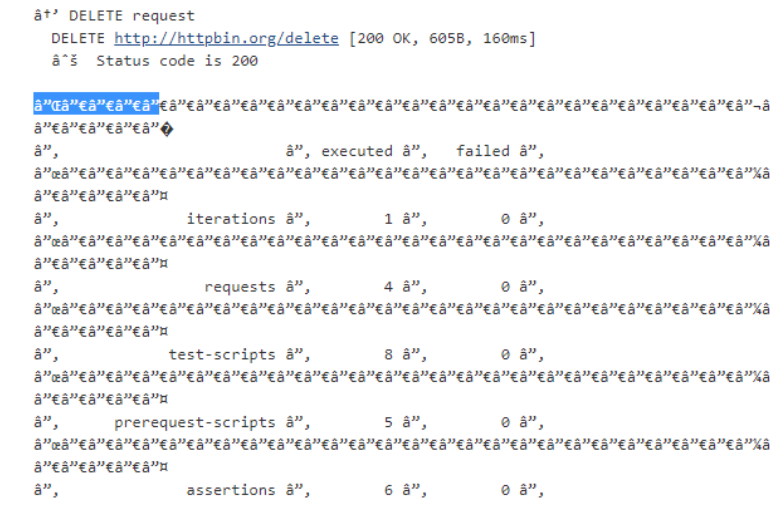

******
Newman
******

How to set delay while running a collection?
--------------------------------------------

You have a collection and have a requirement to insert a delay of 10 secs after every request.

In order to do that you can use the ``--delay`` parameter and specifiy a delay in miliseconds. ::

    newman run collection.json --delay 10000

Jenkins is showing wierd characters in the console. What to do?
---------------------------------------------------------------

If the Newman output in your CI server is not properly displayed, try adding following flags: ``--disable-unicode`` or / and ``--color off``

Example: ::

    newman run collection.json --disable-unicode

How to pass machine name and port number dynamically when running the tests?
----------------------------------------------------------------------------

Suppose, the URL to the server under the test may be different every time you get a new environment for testing, which is common with cloud environments. i.e. the part machine_name:port_number may be different. 

There can be multiple way to do it, so below is one possible solution:

You can set global variables using newman from the CLI. ::

    newman run my-collection.json --global-var "machineName=mymachine1234" --global-var "machinePort=8080"

In your request builder, just use them as ``https://{machineName{}}:{‌{machinePort}}``.
